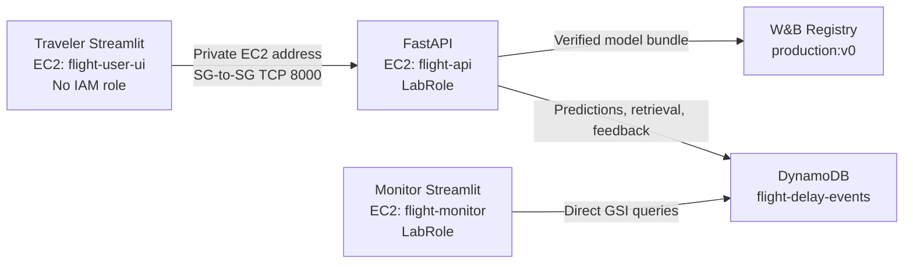

# U.S. Flight Delay MLOps

A complete MLOps system that estimates, before departure, whether a scheduled U.S. domestic flight
will arrive at least 15 minutes late. It combines leakage-safe feature engineering, experiment
tracking, immutable model release controls, registry-backed inference, DynamoDB persistence,
role-separated user and monitoring applications, CI, and a validated three-host AWS deployment.

> **Deployment scope:** The runtime reports `deployment_purpose = academic_demo` and
> `internal_production_gate_passed = false`. The W&B `production` alias selects the actively served
> release; it is not a broader claim of production readiness. Predictions are historical risk
> estimates, not live flight status or guarantees.

## System architecture



The Traveler has neither an AWS role nor a W&B key and calls only FastAPI. FastAPI owns validation,
route context, inference, caching, and event persistence. The Monitor never calls FastAPI; it reads
DynamoDB directly through its EC2 instance profile.

## Validated AWS deployment

The validated reference deployment ran in `us-east-1` on three separate `t3.small` EC2 hosts:

| Host | Component | Authority |
| --- | --- | --- |
| `flight-user-ui` | Traveler Streamlit on port 8501 | No IAM role; private access to API through the Traveler security group |
| `flight-api` | FastAPI on port 8000 | `LabRole` for DynamoDB; W&B key supplied only at runtime |
| `flight-monitor` | Monitor Streamlit on port 8501 | `LabRole` for direct DynamoDB queries; no W&B key |

The data plane used DynamoDB table `flight-delay-events` with String partition key `pk`, on-demand
`PAY_PER_REQUEST` billing, and the `event-date-created-at-index` GSI: String hash key `event_date`,
String range key `created_at`, and `ALL` projection.

The live path demonstrated:

- `GET /health` returning HTTP 200 with both the model and DynamoDB ready;
- `GET /model-info` returning the exact governed `production:v0` identity;
- public Swagger UI exposing all six required endpoints;
- a real Traveler inference request and DynamoDB prediction persistence;
- revisioned feedback write-back and retrieval;
- direct Monitor-to-DynamoDB access through the Monitor instance profile;
- operational volume, success, latency, and cache metrics;
- prediction/target-drift indicators and PSI/Jensen-Shannon input-drift calculations; and
- feedback metrics plus individual prediction inspection.

Representative end-to-end smoke-test record:

| Field | Value |
| --- | --- |
| Prediction ID | `e8d9c837-abe5-4c8c-9d88-4ebdd5c6cf04` |
| Route | `UA DEN → LAX` |
| Delay probability | `0.20431692609038393` |
| Threshold signal | `Above model threshold` |
| Decision threshold | `0.1840285229739868` |
| Risk band | `Medium` |
| Feedback revision | `1` |

This record proves the deployed workflow, not real-world flight performance. The captured live AWS
evidence contains one prediction (`n=1`), so PSI, Jensen-Shannon divergence, prevalence delta,
feedback accuracy, and similar values show that the monitoring pipeline operates end to end; they
are not statistically meaningful production-monitoring estimates.

## Governed release identity

FastAPI reads the serving identity only from `release/release_decision.json`, validates it against
the selection lock, downloads the exact Registry version, verifies all bundle members, and fails
closed if W&B Registry or DynamoDB is unavailable.

| Contract | Frozen value |
| --- | --- |
| Registry collection | `wandb-registry-Model/us-flight-arrival-delay-15m` |
| Serving alias | `production` |
| Registry version | `v0` |
| Registry digest | `865ddd18f6debd44f24a79fc71739f2a` |
| Bundle SHA256 | `2677b7093d66637852705d33bca006c3b78d8119f4d7268801453aa18c22f572` |
| Classification threshold | `0.1840285229739868` |
| Application/image source SHA | `355d99226883ebae1705d9f5a12eaffbe7bc6c8a` |
| Frozen deployment-package commit | `b59672180d5651aa086400ba755e0b724c40ba44` |

Immutable public images:

- API: `ghcr.io/austinyoungblood/us-flight-delay-mlops-api@sha256:7175844d53a46ed96c5cd3198e8fb6defbdf67bd0c640999914272b26e9433d4`
- Traveler: `ghcr.io/austinyoungblood/us-flight-delay-mlops-traveler@sha256:9afd05f6697609fbda7b130ff6e61afa29cab936981ae6f990fe5914fb71fb47`
- Monitor: `ghcr.io/austinyoungblood/us-flight-delay-mlops-monitor@sha256:7b038768c7474d7702909a747014e2725b77654d83aeb0fac1f1dac4db41ef62`

The non-root API container used `MODEL_DOWNLOAD_DIR=/tmp/flight-delay-model` and `HOME=/tmp` for W&B
runtime compatibility. These accommodations did not change model identity or bypass Registry,
digest, or file-hash verification; W&B downloaded and verified all ten release files successfully.
See the [deployment manifest](deploy/deployment_manifest.json),
[model lifecycle design](docs/model-promotion.md), and
[final-test report](docs/final-test-report.md) for the auditable contracts.

## Prediction and persistence contracts

The prediction is made before departure from scheduled carrier, route, calendar, departure/arrival,
elapsed-time, and distance fields. Actual operations or outcomes—including actual departure, taxi,
airborne, arrival, cancellation/diversion, and delay-cause fields—are forbidden. The central leakage
guard rejects both explicitly forbidden and merely unapproved model fields.

FastAPI exposes:

- `GET /health`
- `GET /model-info`
- `POST /predict`
- `GET /route-reliability`
- `GET /predictions/{prediction_id}`
- `POST /feedback/{prediction_id}`

### Worked prediction example

Set `API_BASE_URL` to the reachable API origin, without a trailing slash. No live AWS address is
embedded in this repository.

```bash
curl --fail --silent --show-error \
  --request POST "$API_BASE_URL/predict" \
  --header 'Content-Type: application/json' \
  --data '{
    "carrier": "UA",
    "origin": "DEN",
    "destination": "LAX",
    "flight_date": "2026-08-13",
    "scheduled_departure": "08:00:00",
    "scheduled_arrival": "09:30:00",
    "scheduled_elapsed_minutes": 150,
    "distance_miles": 862.0
  }'
```

Representative response from the governed academic release:

```json
{
  "prediction_id": "e8d9c837-abe5-4c8c-9d88-4ebdd5c6cf04",
  "delay_probability": 0.20431692609038393,
  "predicted_delayed": true,
  "risk_band": "medium",
  "classification_threshold": 0.1840285229739868,
  "route_reliability": [],
  "support_warning": null,
  "model_alias": "production",
  "model_version": "v0",
  "model_digest": "865ddd18f6debd44f24a79fc71739f2a",
  "cache_hit": false,
  "latency_ms": 64.28,
  "created_at": "2026-08-13T22:47:31.821000Z"
}
```

`delay_probability` is the estimated chance of arriving at least 15 minutes late. Here,
`predicted_delayed=true` means `0.2043` exceeded the model's selected operating threshold of
`0.1840`; it does **not** mean the model assigned greater than 50% probability to a delay.
`risk_band` is the threshold-relative display category, while the model alias, version, and digest
identify the exact served release. `cache_hit` describes inference reuse, and `latency_ms` is the
total API processing time reported for the request.

Interactive OpenAPI documentation is available at `/docs`. A successful prediction response is
returned only after its unique event has been persisted. Feedback is revisioned on the same record,
and monitoring queries use bounded UTC windows through the GSI.

## Local development

Python 3.11 is required. Tests use fake or disabled integrations and require no network credentials.

```bash
python3.11 -m venv .venv
source .venv/bin/activate
python -m pip install -c requirements.lock ".[dev]"

ruff check .
ruff format --check .
pytest --cov=flight_delay --cov-branch --cov-report=term-missing --cov-fail-under=82
```

For a local application rehearsal, copy `.env.example` to ignored `.env` and supply only the W&B
values required by the API. Docker Compose uses explicit dummy AWS credentials and DynamoDB Local;
never place live cloud credentials in `.env`.

```bash
docker compose up -d --build
curl http://127.0.0.1:8000/health
curl http://127.0.0.1:8501/_stcore/health
curl http://127.0.0.1:8502/_stcore/health
```

Default host ports are API `8000`, DynamoDB Local `8001`, Traveler `8501`, and Monitor `8502`.

### Governed monitoring traffic

The monitoring-load utility creates deterministic, leakage-safe scheduled-flight requests and sends
them only through the real `POST /predict` path. It is a dry run unless `--apply` is supplied:

```bash
PYTHONPATH=src python scripts/generate_monitoring_traffic.py \
  --count 50 \
  --seed 42 \
  --rate-per-second 2

PYTHONPATH=src python scripts/generate_monitoring_traffic.py \
  --api-base-url "$API_BASE_URL" \
  --count 50 \
  --seed 42 \
  --rate-per-second 2 \
  --apply
```

Counts are restricted to 1–500 requests and the rate is capped at 10 requests/second. The default
audit is written beneath ignored `artifacts/` and records the timestamp, seed, attempted/successful/
failed counts, and returned prediction IDs without storing the API URL or credentials. These records
are synthetic load-test inference traffic—not organic traveler activity and not direct `demo_data`
items. They exercise request validation, model inference, caching, and DynamoDB persistence through
FastAPI. The utility does not create feedback, write DynamoDB directly, use the AWS SDK, mutate W&B,
or depend on final-test data. Its implementation lives in the AWS-independent
`flight_delay.load_testing` package, separate from the DynamoDB-backed monitoring data plane.

## Data and experiment lineage

Experiment runs, model and dataset artifacts, and release lineage are available in the public
[Weights & Biases project](https://wandb.ai/austin-youngblood-university-of-denver/us-flight-delay-mlops/overview).

The workflow uses the BTS
[`On_Time_Reporting_Carrier_On_Time_Performance` archives](https://transtats.bts.gov/PREZIP/),
applies a deterministic class-stratified monthly cap of 75,000 eligible rows with seed 42, and uses
half-open temporal splits:

- train: `[2025-01-01, 2025-11-01)` — 750,000 rows;
- validation: `[2025-11-01, 2026-01-01)` — 150,000 rows; and
- sealed test: `[2026-01-01, 2026-06-01)` — 375,000 rows.

Historical validation-only experiment results at threshold 0.5:

| Run | Accuracy | Precision | Recall | F1 | Average precision | ROC-AUC | Brier | Log loss |
| --- | ---: | ---: | ---: | ---: | ---: | ---: | ---: | ---: |
| Dummy prior | 0.76334 | 0 | 0 | 0 | 0.23666 | 0.5 | 0.180962 | 0.548087 |
| Candidate A | 0.569967 | 0.302541 | 0.625961 | 0.407923 | 0.320719 | 0.622293 | 0.245282 | 0.684221 |

These historical experiment artifacts are separate from the governed Registry release:
[`flight-delay-model:v0`](https://wandb.ai/austin-youngblood-university-of-denver/us-flight-delay-mlops/artifacts/model/flight-delay-model/v0)
and
[`flight-delay-model:v1`](https://wandb.ai/austin-youngblood-university-of-denver/us-flight-delay-mlops/artifacts/model/flight-delay-model/v1).

## Repository map and evidence

```text
.
├── .github/workflows/       # CI and controlled promotion workflow
├── configs/                 # Training and promotion policy
├── deploy/                  # Frozen manifest and idempotent host scripts
├── docs/                    # Architecture, lifecycle, reports, and runbooks
├── evidence/                # Deployment evidence manifest
├── aws/screenshots/         # Curated live AWS/application evidence
├── infra/                   # DynamoDB provisioning contract
├── scripts/                 # Validation, smoke, and controlled utility commands
├── services/                # API, Traveler UI, and Monitor UI images
├── src/flight_delay/        # Reusable application and MLOps packages
└── tests/                   # Unit and integration coverage
```

The [evidence manifest](evidence/evidence_manifest.json) identifies each required criterion, its
verification mode (`public_url` or `screenshot`), and its availability without substituting local
output for AWS proof. Non-required supplemental captures are labeled separately. Detailed
implementation history remains available in
[docs/implementation-status.md](docs/implementation-status.md).

## Secret and artifact policy

Raw/processed BTS data, trained models, W&B files, AWS credentials, `.env`, caches, SSH material, and
large generated artifacts are excluded from Git. `.env.example` contains names and non-secret
defaults only. Secrets belong only in runtime secret stores or the ignored local environment file;
they must never appear in source, manifests, logs, reports, or screenshots.
