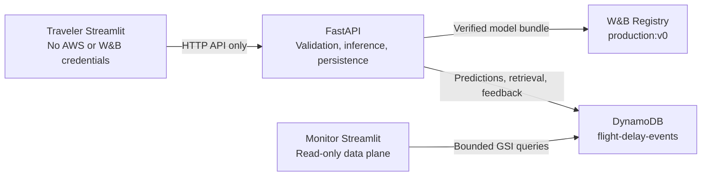

# U.S. Flight Delay MLOps

## 1. Project purpose and academic-governance disclosure

This project estimates, before departure, whether a scheduled U.S. domestic flight will arrive at
least 15 minutes late. It demonstrates an end-to-end MLOps system: leakage-safe features,
reproducible experiments, governed model selection, immutable release controls, Registry-backed
inference, persistent prediction events, monitoring, and CI/CD.

The deployed alias is explicitly scoped as an academic demonstration:

- `deployment_purpose=academic_demo`
- `internal_production_gate_passed=false`

The W&B `production` alias identifies the actively served frozen release. It is not a claim that the
model passed the project's stricter internal production-quality gate. Predictions are historical
risk estimates, not live flight status or guarantees.

## 2. Architecture



The Traveler calls FastAPI only and has no AWS role or W&B key. FastAPI owns request validation,
route context, inference, caching, and event persistence. The Monitor never loads the model or calls
FastAPI; it reads the DynamoDB monitoring data plane directly with bounded UTC queries. The
time-bounded validated deployment used separate API, Traveler, and Monitor hosts. Historical host,
container-image, and network evidence is indexed by the
[deployment manifest](deploy/deployment_manifest.json) and
[evidence manifest](evidence/evidence_manifest.json).

## 3. Frozen deployed model identity

FastAPI takes its serving identity from `release/release_decision.json`, verifies it against the
selection lock, downloads the exact Registry version, validates every bundle member, and fails
closed if the Registry or persistence dependency is unavailable.

| Contract | Frozen value |
| --- | --- |
| Registry collection | `wandb-registry-Model/us-flight-arrival-delay-15m` |
| Serving alias | `production` |
| Registry version | `v0` |
| Registry digest | `865ddd18f6debd44f24a79fc71739f2a` |
| Bundle SHA-256 | `2677b7093d66637852705d33bca006c3b78d8119f4d7268801453aa18c22f572` |
| Classification threshold | `0.1840285229739868` |
| Deployment purpose | `academic_demo` |
| Internal production gate | `false` |

The release identity is unchanged by the v1, v2, and v3 challenger tracks.

## 4. Final validated system state

The final live smoke status was `passed`:

- API, Traveler, and Monitor reported ready.
- Two prediction requests returned unique prediction IDs.
- Both predictions were retrieved through the application contract.
- The second prediction was an inference-cache hit.
- Revisioned feedback persisted.
- Application persistence and retrieval were verified; this smoke did not claim a separate,
  workstation-side DynamoDB SDK inspection.

The compact, sanitized record is
[`evidence/final_live_smoke_summary.json`](evidence/final_live_smoke_summary.json). Its source is an
ignored raw smoke record with SHA-256
`6a6af69da3b5b930fa6127387e7abf0de020f3095dc728f7ce8ab2d6ad988b54`; endpoints, payloads,
credentials, account data, and local paths are intentionally excluded from the committed summary.

The final hermetic validation baseline is 809 passing tests with 86.69% branch-inclusive coverage.
CI enforces a minimum of 86%.

## 5. Local quick start

Python 3.11 is required. Install the complete development and governed-modeling environment with
all three constraint files:

```bash
python3.11 -m venv .venv
source .venv/bin/activate
python -m pip install \
  -c requirements.lock \
  -c requirements-v1.lock \
  -c requirements-v2.lock \
  -e ".[dev,v1,v2]"
make validate
```

For a local application rehearsal, copy the non-secret Compose template to the ignored root `.env`
file, then supply your own W&B entity and API key. Never put AWS credentials in this file.

```bash
cp deploy/env/local-compose.env.template .env
docker compose --env-file .env config --quiet
docker compose --env-file .env up -d --build

curl --fail http://127.0.0.1:8000/health
curl --fail http://127.0.0.1:8501/_stcore/health
curl --fail http://127.0.0.1:8502/_stcore/health
```

Default host ports are API `8000`, DynamoDB Local `8001`, Traveler `8501`, and Monitor `8502`.
Local Compose uses dummy credentials and the local DynamoDB endpoint; populated `.env` files remain
untracked. Live host files use the separate templates and controls in
[`deploy/env/`](deploy/env/README.md).

## 6. API surface

FastAPI exposes exactly six application endpoints:

- `GET /health`
- `GET /model-info`
- `POST /predict`
- `GET /route-reliability`
- `GET /predictions/{prediction_id}`
- `POST /feedback/{prediction_id}`

### Worked prediction example

Set `API_BASE_URL` to a reachable API origin without a trailing slash. No live endpoint is embedded
in this repository.

```bash
curl --fail --silent --show-error \
  --request POST "$API_BASE_URL/predict" \
  --header 'Content-Type: application/json' \
  --data '{
    "carrier": "UA",
    "origin": "DEN",
    "destination": "LAX",
    "flight_date": "2026-08-13",
    "scheduled_departure": "08:00:00",
    "scheduled_arrival": "09:30:00",
    "scheduled_elapsed_minutes": 150,
    "distance_miles": 862.0
  }'
```

The response includes the probability, threshold-relative delayed decision and risk band, frozen
model identity, cache status, and a persisted prediction identifier. A successful response is
returned only after persistence. `predicted_delayed=true` means the probability meets the frozen
`0.1840285229739868` threshold; it does not mean the probability exceeds 50%. Interactive OpenAPI
documentation is available at `/docs`.

Only scheduled, pre-departure fields are model inputs. Actual operations and outcomes—including
actual departure, taxi, airborne, arrival, cancellation/diversion, and delay-cause fields—are
forbidden by the central leakage guard.

`POST /predict` accepts the controlled `X-Traffic-Source` header. Persisted values are
`traveler_ui`, `synthetic_load_test`, `api_unspecified`, or the read-only compatibility value
`legacy_unattributed`. Provenance is event metadata, not a model feature or inference-cache input.

## 7. Monitoring and provenance evidence

For UTC 2026-08-14 through 2026-08-19 with demo data excluded, the validated Monitor evidence was:

| Metric | Result |
| --- | ---: |
| Requests / successes | 461 / 461 |
| Errors | 0 |
| `synthetic_load_test` | 305 |
| `legacy_unattributed` | 155 |
| `traveler_ui` | 1 |
| Cache hits | 34 (`7.4%`) |
| p95 latency | `28.353 ms` |

The synthetic population consists of five provenance-canary events plus two 150-request API-only
batches. The scheduled August 15 batch completed 150/150; the operator-invoked August 19 batch also
completed 150/150. Neither represents organic traveler behavior or model-performance evidence. The
scheduled August 16 and 17 attempts timed out before traffic generation and remain recorded as
availability failures.

Detailed provenance, audit hashes, filtering interpretation, and evidence status are in
[`docs/monitoring-evidence.md`](docs/monitoring-evidence.md).

The load generator is dry-run by default and sends applied requests only through `POST /predict`:

```bash
PYTHONPATH=src python scripts/generate_monitoring_traffic.py \
  --count 50 \
  --seed 42 \
  --rate-per-second 2
```

Applied execution additionally requires a credential-free HTTP(S) API origin and `--apply`. Counts
are restricted to 1–500 and rate to at most 10 requests/second. It neither imports the AWS SDK nor
writes DynamoDB directly, creates feedback, mutates W&B, or accesses final-test data.

## 8. Governed v1/v2/v3 challenger outcomes

| Track | Frozen development outcome |
| --- | --- |
| v1 | [all six November finalists had no eligible threshold](docs/v1-model-experiment-result.md) |
| v2 | [all 12 November finalists had no eligible threshold](docs/v2-model-experiment-result.md) |
| v3 | [all 15 November finalists had no eligible threshold](docs/v3-model-experiment-result.md) |

`no_eligible_threshold` is the explicit threshold-eligibility stop. Because eligibility failed, the
workflows short-circuited before downstream November stability, discrimination, calibration, and
ranking gates; those downstream gates were not evaluated and must not be described as failed.

V3 recovery corrected an exact-selector execution defect under a read-only authorization, then
reproduced the governed stop. No track created a winner lock, advanced to December qualification,
changed the threshold, mutated Registry aliases, or replaced `production:v0`.

## 9. Data and leakage boundaries

The frozen v0 lineage uses deterministic, class-stratified monthly sampling from January 2025
through May 2026. Its January-May 2026 historical final test was consumed exactly once under the
frozen one-time protocol. It remains prohibited for retraining, recalibration, threshold selection,
or challenger evaluation; v1, v2, and v3 did not reopen it.

V3 uses a separate, uncapped 2024-2025 lineage for seasonal and temporal development. Its governed
execution and recovery stopped on November threshold eligibility before December qualification.
December was not opened or scored during that governed execution. Detailed split provenance and the
separate historical implementation-testing disclosure are documented in
[`data/README.md`](data/README.md) and the
[`v3 result report`](docs/v3-model-experiment-result.md).

Raw archives, prepared Parquet, trained model files, and W&B run directories are excluded from Git.
Only compact manifests, locks, and governed result records are versioned.

## 10. Testing, CI/CD, security, and evidence navigation

`make validate` runs the CI-aligned offline checks: Ruff, formatting, the complete branch-coverage
suite, all v1/v2/v3 protocol and dry-run validators, deployment/evidence validation, deployment-shell
syntax, and Compose rendering. It does not contact AWS or W&B, open governed data, fit models,
publish images, or mutate release state. Pull-request CI additionally builds all three service
images and proves modeling-only dependencies are absent from runtime containers.

Secrets, local credential stores, raw/processed data, model bundles, caches, local W&B state,
screenshot staging sources, and generated artifacts are ignored. Curated screenshots remain tracked
only under `aws/screenshots/` and are indexed by the evidence manifest.

Key references:

- [Architecture](docs/architecture.md)
- [Model card](docs/model-card.md)
- [Release decision](release/release_decision.json)
- [Deployment manifest](deploy/deployment_manifest.json)
- [Evidence manifest](evidence/evidence_manifest.json)
- [Evidence checklist](docs/final-evidence-checklist.md)
- [Submission readiness](docs/submission-readiness.md)
- [Monitoring evidence](docs/monitoring-evidence.md)
- [Public W&B project](https://wandb.ai/austin-youngblood-university-of-denver/us-flight-delay-mlops/overview)

No license is included; absent an owner-selected license, normal copyright restrictions apply.
