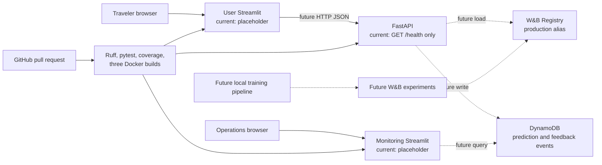

# Architecture

## Current Brief 01 boundary

The current repository contains pure preprocessing primitives, Pydantic contracts, a health-only
FastAPI process, and two transparent Streamlit placeholders. No model, W&B artifact, DynamoDB table,
AWS host, live API integration, or production monitoring exists yet.

## Intended final architecture

Solid arrows describe the planned production flow. Dashed labels identify future components that
are represented only by contracts or directories today.

## Separation of concerns

- FastAPI will own request validation, inference, caching, and prediction/feedback persistence.
- The traveler UI will call FastAPI and will never load a model or write DynamoDB directly.
- The monitoring UI will remain a separately deployable service and later query DynamoDB directly.
- Offline training will be the only component that creates model artifacts and route statistics.
- The leakage guard is reusable by future training code and allows only scheduled pre-departure
  features.

## Data flow and leakage boundary

Eligibility filtering removes cancelled, diverted, and missing-target records before target
construction. Chronological half-open intervals preserve train → validation → test order. Actual
departure, arrival, outcome, and delay-cause fields are centrally forbidden from any model schema.
Historical route reliability remains descriptive context rather than a model feature in the MVM.
