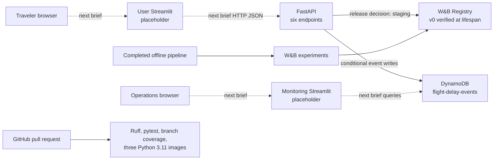

# Architecture

## Brief 06 boundary

The production-shaped backend is implemented. FastAPI resolves the immutable W&B Registry alias
declared by the committed release decision, verifies all locked bytes, loads the model and route asset
once during lifespan, and requires DynamoDB persistence for every successful prediction. The traveler
and monitoring Streamlit services remain placeholders. No EC2 deployment or monitoring computation is
part of this brief.

## Runtime sequence

1. Lifespan parses `release/release_decision.json`; no environment variable may override the alias.
2. The W&B Public API resolves `wandb-registry-Model/us-flight-arrival-delay-15m:staging`.
3. Version, Registry/source digest, committed selection lock, every file hash, aggregate digest,
   leakage-safe feature schema, threshold, model load, route asset and deterministic canary are
   verified before readiness.
4. The DynamoDB adapter validates table access and conditionally records `MODEL#v0` metadata.
5. `/health` becomes ready only after both dependencies succeed. Any failure remains inspectable but
   `/predict` returns 503; no local artifact fallback exists.
6. A prediction caches only deterministic inference/route output. Every request still receives a new
   UUID/timestamp and a conditional `PREDICTION#<uuid>` write before success.
7. Feedback conditionally revisions the existing prediction item. Strongly consistent reads power
   retrieval and prepare the data plane for the separate monitoring UI.

## DynamoDB access pattern

- Table: `flight-delay-events`, PAY_PER_REQUEST.
- Primary key: String `pk` (`PREDICTION#<uuid>` or `MODEL#<registry-version>`).
- GSI: `event-date-created-at-index`, String partition key `event_date`, String sort key
  `created_at`, projection ALL.
- Writes: no-overwrite prediction put; immutable-identity model metadata update; existing-item,
  optimistic-revision feedback update.
- Reads: strongly consistent prediction reads. The next monitoring brief can query event days through
  the GSI without direct model access.

## Leakage and ownership boundaries

Only scheduled pre-departure fields reach the model; the central leakage guard revalidates the
downloaded feature schema. Historical route reliability is descriptive output and never a model
feature. FastAPI owns model access and prediction/feedback writes. The future traveler UI will only
call FastAPI; the separate future monitoring UI will consume the DynamoDB data plane.
