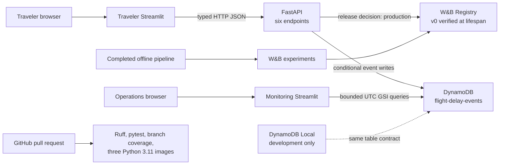
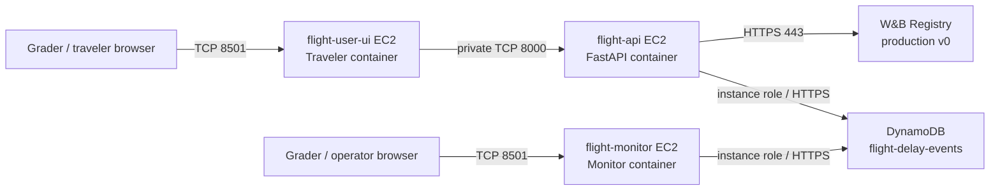

# Architecture

## Final pre-AWS deployment boundary

The production-shaped backend is implemented. FastAPI resolves the immutable W&B Registry alias
declared by the committed release decision, verifies all locked bytes, loads the model and route asset
once during lifespan, and requires DynamoDB persistence for every successful prediction. The traveler
application calls FastAPI only. The monitoring application reads DynamoDB only and never imports or
loads the model. DynamoDB Local is the sole persistence runtime used in this increment. No AWS Academy
session activation, AWS service call, or EC2 deployment is part of this increment. The `production`
alias is course deployment metadata, not internal production-quality certification.

## Final live topology (documented, not executed)

The API ingress source is the traveler security group (private `/32` only as a documented Academy
fallback). Public Streamlit ingress is limited to the grader/demo range when known. All three images
are selected from `deployment_manifest.json` by registry content digest, and no temporary AWS
credentials enter an image or host environment file.

## Runtime sequence

1. Lifespan parses `release/release_decision.json`; no environment variable may override the alias.
2. The W&B Public API resolves `wandb-registry-Model/us-flight-arrival-delay-15m:production`.
3. Version, Registry/source digest, committed selection lock, every file hash, aggregate digest,
   leakage-safe feature schema, threshold, model load, route asset and deterministic canary are
   verified before readiness.
4. The DynamoDB adapter validates table access and conditionally records `MODEL#v0` metadata.
5. `/health` becomes ready only after both dependencies succeed. Any failure remains inspectable but
   `/predict` returns 503; no local artifact fallback exists.
6. A prediction caches only deterministic inference/route output. Every request still receives a new
   UUID/timestamp and a conditional `PREDICTION#<uuid>` write before success.
7. Feedback conditionally revisions the existing prediction item. Strongly consistent reads power
   retrieval.
8. Monitoring queries one UTC `event_date` GSI partition at a time, consumes every page, and enforces
   a 31-day interactive limit. GSI aggregates are explicitly eventually consistent.

## DynamoDB access pattern

- Table: `flight-delay-events`, PAY_PER_REQUEST.
- Primary key: String `pk` (`PREDICTION#<uuid>` or `MODEL#<registry-version>`).
- GSI: `event-date-created-at-index`, String partition key `event_date`, String sort key
  `created_at`, projection ALL.
- Writes: no-overwrite prediction put; immutable-identity model metadata update; existing-item,
  optimistic-revision feedback update.
- Reads: strongly consistent prediction inspection and bounded, fully paginated, eventually
  consistent GSI queries for monitoring. The only normal-path scan is a bounded metadata-only lookup.

## Leakage and ownership boundaries

Only scheduled pre-departure fields reach the model; the central leakage guard revalidates the
downloaded feature schema. Historical route reliability is descriptive output and never a model
feature. FastAPI owns model access and prediction writes. The traveler UI calls FastAPI for every
operation, including feedback. The separate monitoring UI consumes only the DynamoDB data plane and
may revision feedback for adjudication. Demo records are deterministic, explicitly labeled, and never
represented as real inference.
